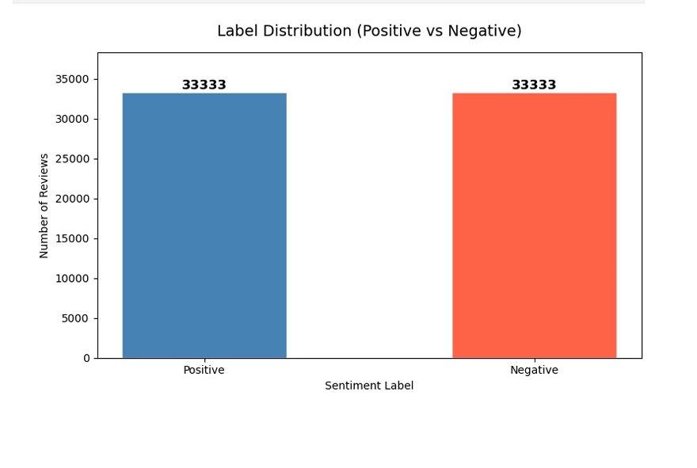
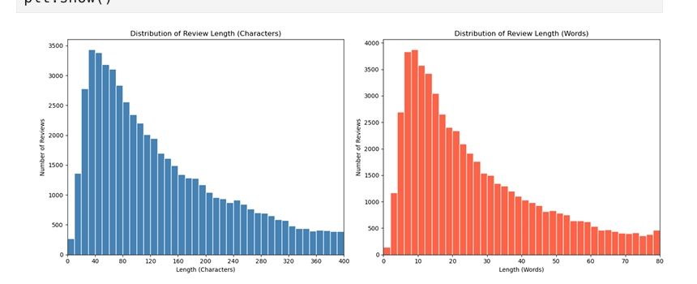
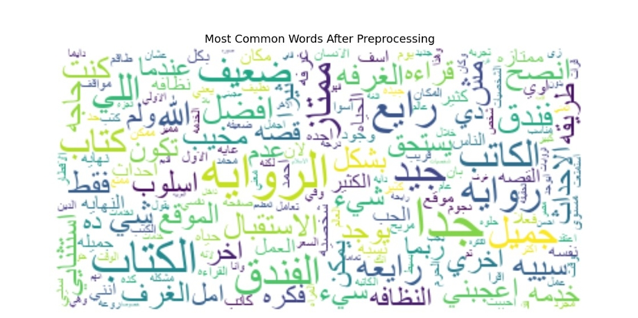
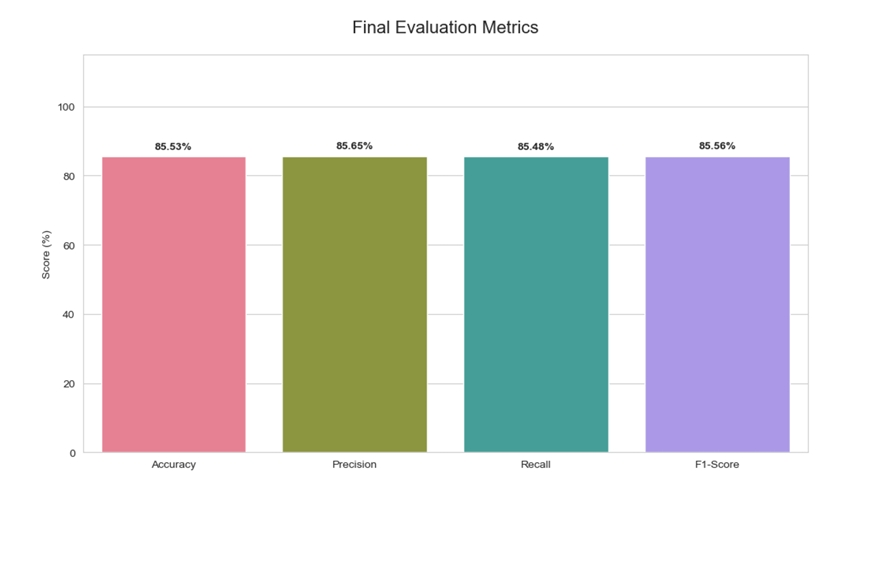

# Arabic Reviews NLP — Sentiment Analysis with Naive Bayes

A binary sentiment classification system for Arabic-language user reviews, built using classical NLP techniques and a Complement Naive Bayes model. The pipeline includes custom Arabic preprocessing, negation handling, sentiment lexicon boosting, and TF-IDF vectorization.

---

## Table of Contents

- [Project Overview](#project-overview)
- [Dataset](#dataset)
- [Exploratory Data Analysis](#exploratory-data-analysis)
- [Preprocessing Pipeline](#preprocessing-pipeline)
- [Modeling](#modeling)
- [Results](#results)
- [Sample Predictions](#sample-predictions)
- [Requirements](#requirements)

---

## Project Overview

This project classifies Arabic reviews as either Positive or Negative using a machine learning pipeline designed specifically for Arabic text. It addresses key challenges in Arabic NLP such as dialectal variation, attached prefixes, diacritics, and negation.

**Task:** Binary Sentiment Classification (Positive / Negative)  
**Language:** Arabic (Modern Standard + Egyptian dialect)  
**Model:** Complement Naive Bayes (ComplementNB)  
**Vectorization:** TF-IDF with unigrams and bigrams

---

## Dataset

- **Total Samples:** 66,666 Arabic reviews
- **Format:** Excel (.xlsx)
- **Columns:** `label` (Positive / Negative), `text` (raw Arabic review)
- **Balance:** Perfectly balanced — 33,333 samples per class
- **Duplicates / Missing Values:** None

The balanced class distribution makes evaluation metrics reliable and avoids any bias toward a majority class.

---

## Exploratory Data Analysis

### Label Distribution

The dataset is perfectly balanced with 33,333 positive and 33,333 negative reviews.

<p align="center">
  
</p>

### Review Length Distribution

Most reviews are short to medium length. The character distribution peaks around 40-80 characters, and the word distribution peaks around 5-15 words, both following a right-skewed pattern typical of user-generated content.

<p align="center">
  
</p>

### Word Cloud (After Preprocessing)

The word cloud displays the most frequent Arabic words after full preprocessing — stopwords removed, prefixes split, and text normalized. Prominent words reflect the review domains: hotels, books, and products.

<p align="center">
   
</p>

---

## Preprocessing Pipeline

Arabic text requires a specialized pipeline due to its morphological complexity. The following steps are applied in order:

**1. Prefix Splitting**  
Attached Arabic prefixes (e.g., "وال", "بال", "فال") are detached from root words. Only prefixes where the remaining word has 3 or more characters are split, to avoid producing meaningless single-letter tokens.

**2. Text Cleaning**  
Removes URLs, English characters, Western and Arabic-Indic digits, and all non-Arabic characters. Extra whitespace is normalized.

**3. Arabic Normalization**  
Standardizes Hamza variants to bare Alef, normalizes Alef Maqsura to Ya, Ta Marbuta to Ha, and removes all diacritics (Tashkeel). This ensures that spelling variants of the same word are treated identically.

**4. Tokenization**  
Whitespace-based tokenization, which outperforms NLTK's punkt tokenizer for this Arabic sentiment dataset.

**5. Negation Handling**  
Negation words (ليس, لم, مش, غير, etc.) trigger a `NEG_` prefix on the following token. For example, "ليس رائع" becomes `NEG_رايع`, which the model treats as a distinct negative feature.

**6. Stopword Removal**  
Uses NLTK's Arabic stopword list extended with additional prepositions and dialect-specific words. Stopwords are normalized before matching to handle spelling variants.

**7. Sentiment Lexicon Boosting**  
A manually curated lexicon of 88 positive and 74 negative Arabic words (including Egyptian dialect terms) is used. Words found in the lexicon are duplicated in the token sequence, effectively doubling their TF-IDF weight.

**8. Stemming**  
NLTK's ISRIStemmer is applied after boosting. `NEG_`-prefixed tokens are stemmed on the word part only, preserving the negation prefix.

---

## Modeling

### Vectorization

TF-IDF with the following configuration:

| Parameter      | Value          |
|----------------|----------------|
| max_features   | 7,000          |
| ngram_range    | (1, 2)         |
| min_df         | 5              |
| max_df         | 0.95           |
| sublinear_tf   | True           |

The resulting feature matrix has shape (65,754 x 7,000).

### Train / Test Split

| Split     | Samples |
|-----------|---------|
| Training  | 52,603  |
| Testing   | 13,151  |

Stratified splitting ensures equal class representation in both sets.

### Algorithm: Complement Naive Bayes

ComplementNB was chosen over MultinomialNB because it is specifically designed for imbalanced or noisy text classification. Alpha tuning via 3-fold cross-validation was performed across values [0.01, 0.05, 0.1, 0.2, 0.3, 0.5, 1.0]. The best alpha was **0.2** with a cross-validation accuracy of **84.75%**.

---

## Results

### Evaluation Metrics

| Metric    | Score   |
|-----------|---------|
| Accuracy  | 85.53%  |
| Precision | 85.65%  |
| Recall    | 85.48%  |
| F1-Score  | 85.56%  |

<p align="center">
  
</p>

### Confusion Matrix

<p align="center">
  
</p>

| | Predicted Negative | Predicted Positive |
|---|---|---|
| **Actual Negative** | 5,609 | 945 |
| **Actual Positive** | 958 | 5,639 |

The model performs symmetrically on both classes, with similar false positive and false negative rates, which is expected given the balanced dataset.

---

## Sample Predictions

| Review (Arabic) | Prediction | Confidence |
|---|---|---|
| هذا التطبيق ممتاز وسهل الاستخدام | Positive | 96.0% |
| المنتج سيء جدا ولا أنصح بشرائه | Negative | 98.9% |
| الفيلم كان رائعا وممتعا للغاية | Positive | 92.9% |
| خدمة العملاء بطيئة ومحبطة | Negative | 84.9% |
| مش كويس خالص ولا أنصح بيه | Negative | 98.2% |
| ليس سيئا كما توقعت بل كان جيدا | Positive | 65.0% |

The last example demonstrates effective negation handling — "ليس سيئا" (not bad) is correctly classified as Positive despite containing a negative word.

---

## Requirements

```
pandas
numpy
matplotlib
seaborn
nltk
scikit-learn
wordcloud
arabic-reshaper
python-bidi
openpyxl
```

Install with:

```bash
pip install pandas numpy matplotlib seaborn nltk scikit-learn wordcloud arabic-reshaper python-bidi openpyxl
```

---

## Repository Structure

```
arabic-reviews-nlp/
|-- Arabic_Sentiment_Analysis.ipynb   # Main notebook
|-- images/                           # Visualizations used in README
|   |-- label_distribution.png
|   |-- review_length_distribution.png
|   |-- wordcloud.png
|   |-- confusion_matrix.png
|   |-- evaluation_metrics.png
|-- LICENSE
|-- README.md
```
